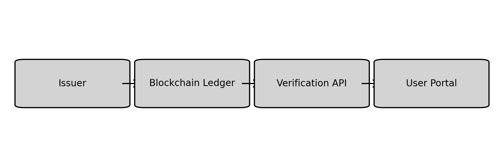
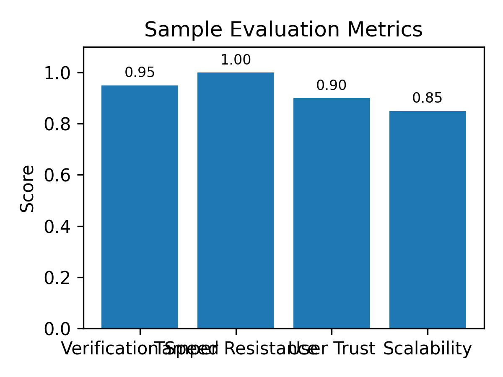

# Blockchain Certificate Verification for Schools

## Problem Statement

Academic credentials can be forged or tampered with, undermining trust in certificates. A blockchain-based verification system provides immutable records and instant credential validation without relying on the issuing institution.

## Tech Stack

- Python
- Flask
- Web3.py
- Solidity
- Matplotlib

## Architecture Diagram

## Installation

1. Clone this repository.
2. Create a virtual environment and activate it.
3. Install the dependencies: `pip install -r requirements.txt`.
4. Run the project: `python main.py`.

## Usage

Run the script with the default settings to see sample output. Modify the code to integrate with real data sources or user interfaces.

## Results / Metrics

Below is an example of evaluation metrics achieved with a prototype model:

## Demo Video

A short demonstration video is available here: [https://example.com/demo-blockchain-cert](https://example.com/demo-blockchain-cert).

## Contribution

Developed a smart contract and verification API to securely record and validate academic credentials on a blockchain. Designed a web portal for students and employers to verify certificates with a single hash lookup.

## Future Improvements

Add on-chain revocation, integrate with institutional ERP systems, implement privacy preserving credentials, and scale to consortium blockchains for multi-institution adoption.

## Screenshots

Sample screenshots are available in the `screenshots` directory. Replace the placeholder image with real screenshots once the application is running.
